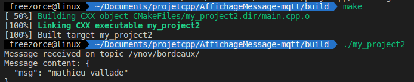
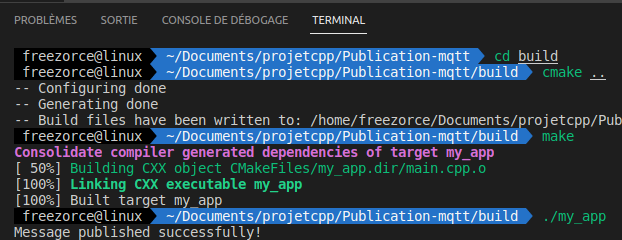
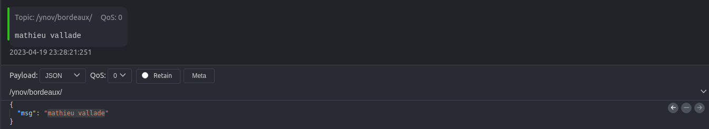

# Projet c++

Sujet : En C++, avec la bibliothèque de votre choix, paho si pas d'idée de bibliothèque, vous allez réaliser deux programmes.

1) Le premier programme doit:
 - se connecter au même broker que celui du TD, et s'abonner au même topic.
 - afficher  avec  "std::cout << ... << std::endl; " , le contenu des messages qu'il lit
 

2) le deuxième programme doit:
  - envoyer un message sur le même topic et broker, le message : prenom , depuis c++

## Affichage message 

   
  
    

## Publication message

   
  
    

   
  
    

